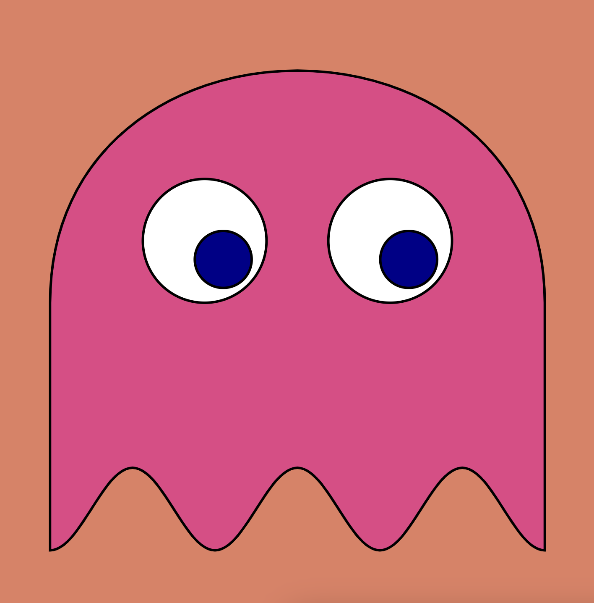
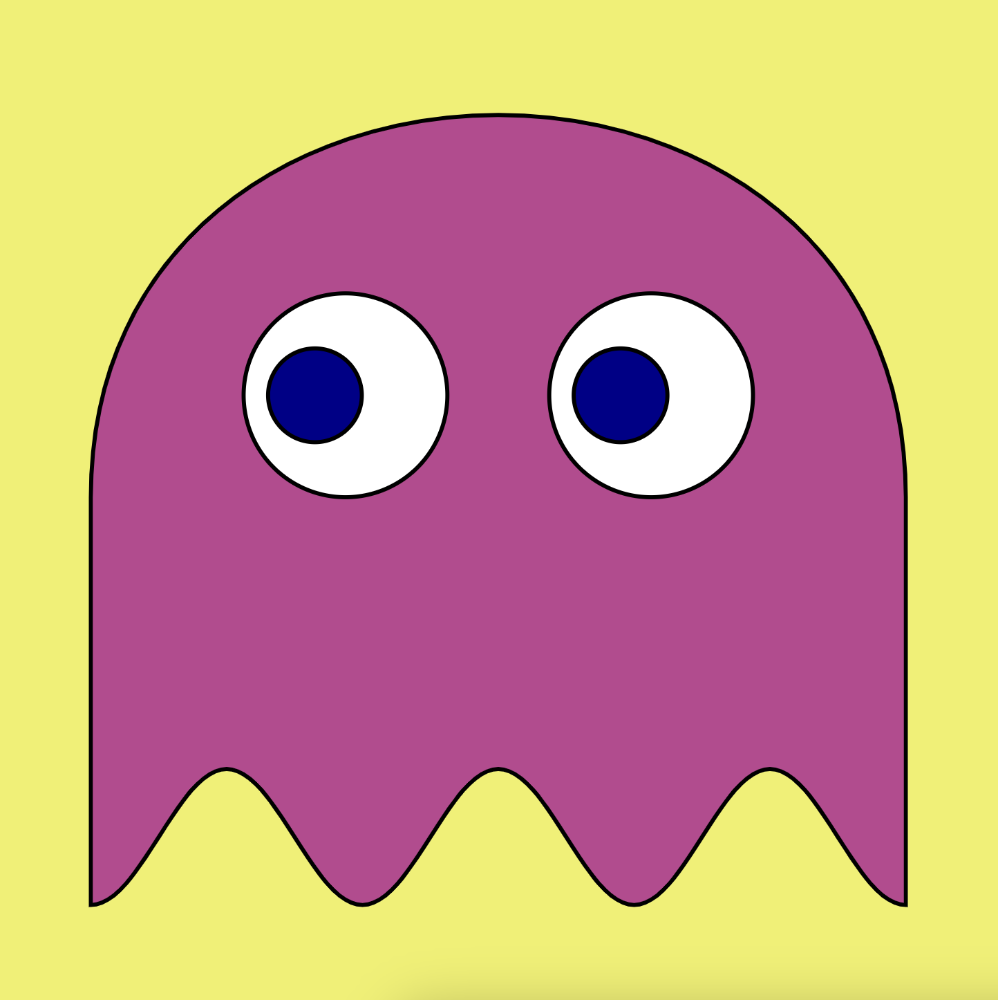
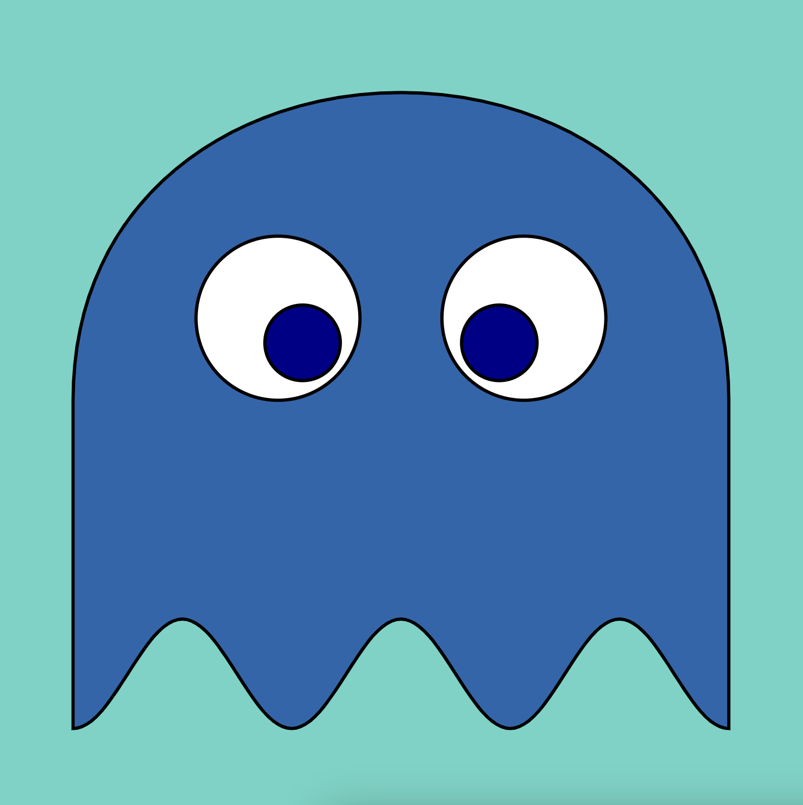
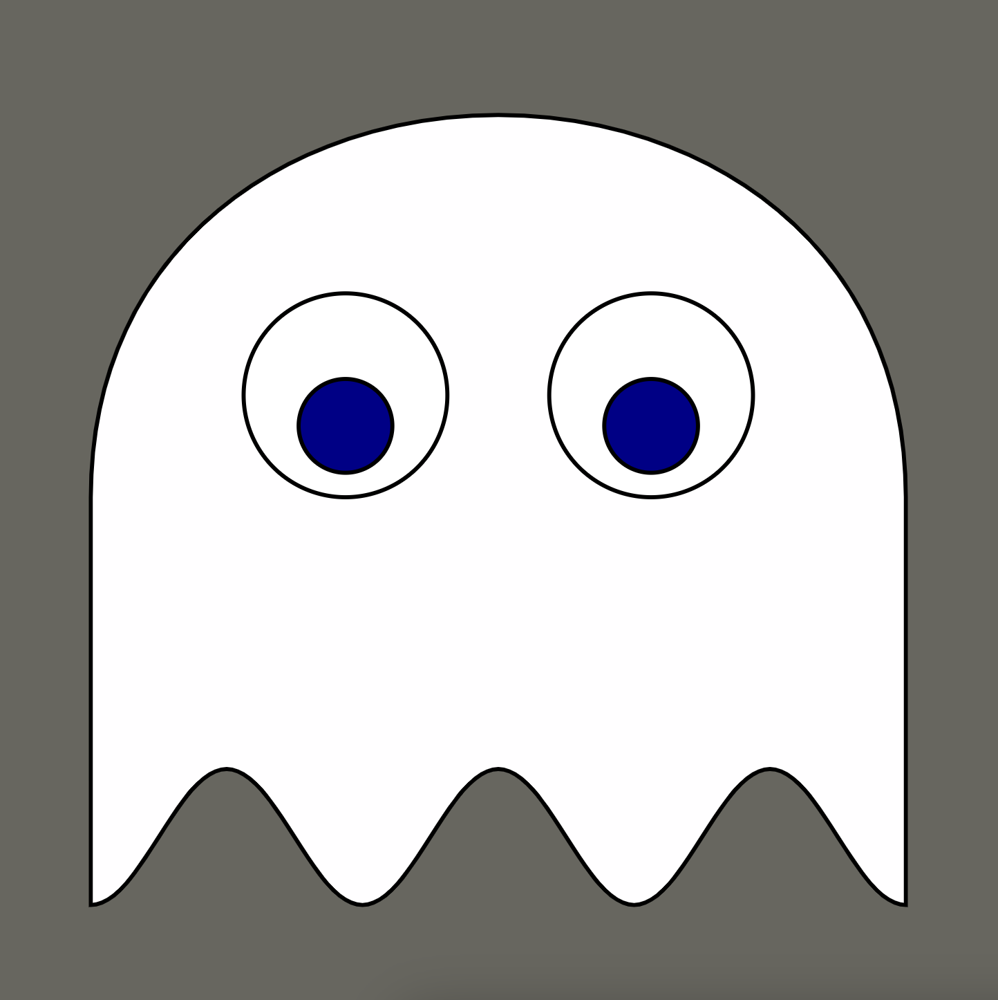

# Ghosts

Ghosts is an ERC404 built for the Blast L2. 690 ghosts roam Pacman's maze, each with upgradable artwork that is rendered on-chain with SVG HTML.

Built using [Foundry](https://book.getfoundry.sh/), and the ERC404 standards from [Pandora Labs](https://github.com/Pandora-Labs-Org)

### Art

|  |  |
| -------- | -------- |
|  |  |
|  |  |

### Deployments

Ghosts: [0x1fDeacf7b5A6acE823b909CA1eaF68C6a887aaAe](https://blastscan.io/address/0x1fdeacf7b5a6ace823b909ca1eaf68c6a887aaae)

WakaV0: [0x18144528d316b17BBd208D022d57bFAe327A97Cc](https://blastscan.io/address/0x18144528d316b17bbd208d022d57bfae327a97cc)